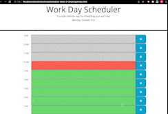

# Scheduler-Week-5-Challenge 

HW 5
## Description

Creating a daily planner/scheduler application where users can save any information to jot down their scheduled activities on their designated timeframe. 
## Link

## Screenshot

## Complied Criteria

* When the application has been opened, the title and the current day is shown on top of the calendar and centered.

* Scheduler is displayed when scrolling down the page along with different hours of the day.

* Time blocks are color-coded depending on the hour where user can differentiate current, have passed, or in the future.

* Text can be typed inside the remark block of each hour when clicked.

* Text that was typed inside the remark block can be saved into the local storage and when the application has been reopened, the text will be repopulated where it was saved, unless another text was saved or it got saved after being deleted.

## Repository